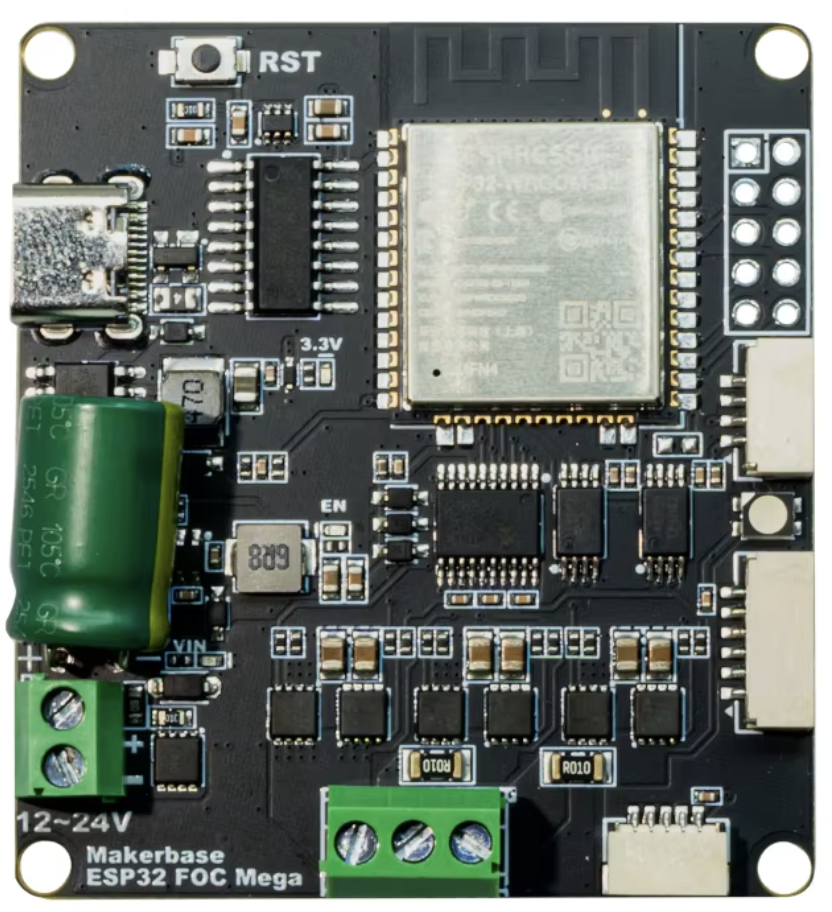

DOI: [10.5281/zenodo.20809345](https://doi.org/10.5281/zenodo.20809345)

# Parallel Mirror Steer-by-Wire

An open-source research platform for bilateral embodied human–robot interaction.

Developed at the MOME Robotics Studio, this repository documents an experimental steer-by-wire system that enables two physically separated BLDC motors to exchange motion through real-time wireless communication and local torque control.

The platform supports research into embodied interaction, haptic reciprocity, adaptive robotics, and Research through Design methodologies.



*Makerbase MKS ESP32 FOC Mega, single-motor board used by the current
prototype. Product image supplied by the project owner from the AliExpress
listing.*

## Abstract

This repository documents a research prototype for a wireless bilateral motor interface. Two BLDC motor nodes exchange angular position data over `ESP-NOW` and generate a mutual spring-like resistance through local torque control. Rather than implementing rigid master-slave tracking, the system explores a softer form of steer-by-wire coupling in which motion on one side is physically felt on the other.

The project sits at the intersection of rapid prototyping, interaction design, and rehabilitation-oriented haptic research. Its main contribution is a working proof of concept for a lightweight, mechanically unlinked, mutually perceivable motor interaction using low-cost embedded hardware.

## Research Context

The prototype was developed as part of a broader investigation into bilateral physical feedback systems. A key motivation was to build an experimental platform that can be iterated quickly and used to study how resistance, compliance, and reciprocity can be designed into small-scale motorized interfaces.

Instead of treating the system as a finished device, this repository presents it as a research instrument: a functional platform for testing haptic behavior, control strategies, and possible future applications in assistive or rehabilitation contexts.

## System Overview

Each node in the system:

- runs a local `FOC` control loop on an `ESP32`
- reads shaft position from an `AS5048` magnetic angle sensor
- sends the measured angle to the other node over `ESP-NOW`
- computes the difference between local and remote angle
- converts that difference into a softened spring response
- falls back to zero torque if communication is lost

This produces a bilateral coupling effect that feels like shared resistance rather than exact positional locking.

## Current Prototype Status

- validated `ESP32 FOC` board pin mapping
- stable open-loop motor test completed
- working `ESP-NOW` communication between two boards
- bilateral mirror behavior running in the protocol-7 handoff firmware
- suitable as a research prototype, not yet as a deployable device

## Hardware Platform

The current prototype uses the single-motor **Makerbase MKS ESP32 FOC Mega**
shown above. This is not the earlier MKS ESP32 FOC board version previously
pictured in the repository. The Mega board can be identified by its
`Makerbase ESP32 FOC Mega` silkscreen, USB-C connector, single three-phase motor
terminal, and two white sensor connectors.

### Main Components

- `2x` Makerbase MKS ESP32 FOC Mega single-motor driver board
- `2x` BLDC motor
- `2x` `AS5048` magnetic angle sensor
- external power supply
- wiring, connectors, and programming interface

### Validated Board Information

| Item | Value / mapping | Notes |
| --- | --- | --- |
| Board | `Makerbase MKS ESP32 FOC Mega` | single-motor hardware used by the current prototype |
| MCU | `ESP32-WROOM-32E` | onboard module |
| Gate driver | `IR2104` | 3 half-bridge drivers |
| MOSFET stage | `30V / 30A` | board-level power stage |
| Current sense | `INA240A2` | active phase-current foldback and telemetry |
| Motor output | `A / B / C` | 3-phase BLDC connection |

### Pinout Used by the Current Sketch

| Function | Pin |
| --- | --- |
| `PWM_A` | `GPIO32` |
| `PWM_B` | `GPIO33` |
| `PWM_C` | `GPIO25` |
| `EN_PIN` | `GPIO12` |
| `SPI_SCK` | `GPIO18` |
| `SPI_MISO` | `GPIO19` |
| `SPI_MOSI` | `GPIO23` |
| `SPI_CS` | `GPIO5` |
| `CURRENT_A` | `GPIO39` |
| `CURRENT_B` | `GPIO36` |
| `VIN_STARTUP` | `GPIO13` |

### Power Note

The current prototype is validated with two separate protected `3S` LiPo packs.
The handoff build and its limits have not been validated outside that setup.

## Control Strategy

The current implementation uses a simple but effective haptic coupling model:

1. local shaft angle is sampled continuously
2. angle data is transmitted to the peer node at about `500 Hz`
3. the angular difference is measured locally
4. a deadband removes small offsets around zero
5. the remaining error is shaped through a nonlinear spring curve
6. the resulting value is applied in torque-voltage mode

Key runtime parameters in the current sketch:

| Parameter | Value | Meaning |
| --- | --- | --- |
| `ESPNOW_CHANNEL` | `1` | fixed communication channel |
| `SEND_PERIOD_US` | `2000` | about `500 Hz` send rate |
| `TIMEOUT_MS` | `250` | link timeout threshold |
| power-stage ceiling | `7.0 V` | board-level voltage ceiling |
| handoff command ceiling | `2.50 V` | boost spring output ceiling |
| boost soft/hard current | `0.52/0.70 A` | fast current foldback envelope |
| sustained thermal current | `0.45/0.60 A` | thermal derating envelope |
| deadband | `0.025 rad` | no-resistance zone around zero |
| PWM carrier | `40 kHz` | synchronized sine PWM |

## Software

### MKS ESP32 FOC Mega port

See the [`firmware documentation`](firmware/README.md) for the purpose and safe
bring-up order of every included sketch.

The staged MKS port is in `firmware/MKS_Bilateral_Link_Test/`. It uses the
validated M0 mapping (`PWM 32/33/25`, enable `12`) and AS5048A SPI mapping
(`SCK 18`, `MISO 19`, `MOSI 23`, `CS 5`). The first-stage firmware exchanges
validated, unwrapped encoder positions over ESP-NOW while keeping both motor
drivers disabled.

The autonomous bilateral controller is in `firmware/MKS_Parallel_Mirror/`.
Both nodes load their stored FOC calibration, establish the ESP-NOW link, zero
their local coordinates, and arm automatically after startup. No USB host or
serial command is required during normal operation. A real link timeout disables
the local power stage; reconnection automatically starts a new synchronized arm
cycle.

The current prototype uses a `7 V` power-stage ceiling with a `2.50 V` handoff
command ceiling. Position error, shaft speed, measured phase current, and an
estimated sustained thermal load are handled with continuous foldback.

Development builds provide gentle, normal, strong, and boost profiles. The
protocol-7 handoff build locks both nodes to the tested boost profile, disables
calibration and profile tuning commands, waits 5 seconds before synchronized
arming, stops after 10 minutes, and latches off after a runtime link fault.

For standalone testing, disconnect USB from both boards and cycle both external
motor supplies. Keep both mechanisms free during the approximately `5 s`
automatic startup interval. Follow the
[`supervised operation guide`](docs/HANDOFF.md).

### Optional RGB status LED

Macro photographs confirm that the part between the two sensor connectors is a
flat four-pad 3528 addressable RGB LED. Makerbase's schematic identifies it as
`XL-3528RGBW-WS2812B` on `GPIO2`. Electrical probing found a PCB footprint
error on both tested boards: the package's top-left `VDD` pad follows `GPIO2`,
while its top-right `DI` pad is tied to `3.3 V`. The data and supply nets are
therefore swapped, so the installed LED cannot be controlled in software.
Status output stays disabled with `HAS_ONBOARD_RGB_LED=false`. Repair requires
lifting and cross-wiring the two upper LED leads, or fitting an external LED.

| Planned LED state | Meaning |
| --- | --- |
| Red-to-green for 3 seconds | Startup 3S LiPo estimate (`10.5-12.6 V`) |
| Flashing red | Battery was below the `11.1 V` startup threshold; auto-arm inhibited |
| Flashing blue | Waiting for the peer or recovering the ESP-NOW link |
| Cyan | Peer visible, synchronization or auto-arm pending |
| Green | Both nodes connected and armed |
| Orange/red | Current foldback is actively reducing motor drive |
| Yellow | Manual stop; automatic restart inhibited until reset or `a` command |

Battery voltage is sampled before Wi-Fi starts because the board routes VIN
measurement to ESP32 `GPIO13` (`ADC2`). Continuous battery measurement is not
reliable while ESP-NOW is active.

See `docs/prototype-checklist.md` for the remaining work before extended human
testing.

Main sketch:

- `firmware/MKS_Parallel_Mirror/MKS_Parallel_Mirror.ino`

Main libraries:

- `SimpleFOC`
- `esp_now`
- `WiFi`
- `esp_wifi`

## Setup

### Requirements

- `Arduino IDE` or `PlatformIO`
- installed `ESP32` board support
- installed `SimpleFOC` library

### Wiring

- connect the BLDC motor to the `A / B / C` outputs
- connect the `AS5048` sensor to the `SPI` pins defined in the sketch
- verify power and ground wiring carefully before startup

### MAC Address Configuration

The sketch contains both validated MAC addresses and identifies node A or B
automatically:

```cpp
static const uint8_t MAC_A[6]={0x30,0xC9,0x22,0x5F,0x5D,0x1C};
static const uint8_t MAC_B[6]={0x30,0xC9,0x22,0x5F,0x5D,0x24};
```

### First Power-Up Checklist

- start with a low `VOLTAGE_LIMIT`
- confirm sensor initialization is stable
- if the direction is reversed, set `MIRROR_SIGN = -1`
- verify that link timeout correctly drops torque to zero

## Parameter Tuning

The most useful parameters for shaping the feel of the interaction are:

- `VOLTAGE_LIMIT` for overall force level
- `SPRING_K` for coupling strength
- `DEAD_BAND_RAD` for center free-play
- `SOFTEN_EXP` for softening the near-zero response
- `SEND_PERIOD_US` for communication update frequency
- `TIMEOUT_MS` for disengagement speed after link loss

## Prototype Limitations

- the current implementation is still a research prototype
- current sensing limits the voltage-mode torque request but has not yet been
  checked against an external calibrated current instrument
- there is no full fault management, emergency stop layer, or production safety envelope
- mechanical integration and long-duration reliability testing are still future work

## Safety Notes

- this is a high-current motor controller board, so initial tests should always be mechanically secured
- incorrect phase order, sensor wiring, or overly high `VOLTAGE_LIMIT` can cause vibration, heating, or sudden motion
- do not treat the current prototype as a clinically validated or deployment-ready system

## Repository Contents

- handoff firmware: `firmware/MKS_Parallel_Mirror/MKS_Parallel_Mirror.ino`
- documentation index: [`docs/README.md`](docs/README.md)
- firmware guide: [`firmware/README.md`](firmware/README.md)
- supervised operation guide: [`docs/HANDOFF.md`](docs/HANDOFF.md)
- Hungarian operator translation: [`docs/HANDOFF-HU.md`](docs/HANDOFF-HU.md)
- development summary: [`docs/development-log.md`](docs/development-log.md)
- prototype readiness checklist:
  [`docs/prototype-checklist.md`](docs/prototype-checklist.md)
- planned custom controller:
  [`hardware/parallel-foc-rev-a/README.md`](hardware/parallel-foc-rev-a/README.md)
- board reference image: `docs/board-overview.png`

## Future Directions

- complete instrumented thermal and externally calibrated current tests
- add continuous battery and motor-temperature monitoring
- add a hardware emergency stop, fuse, guarding, and mechanical travel limits
- complete the custom controller schematic and PCB layout
- define a repeatable user-test protocol and mechanical acceptance test
- continue control refinement using logged, repeatable comparisons

## Project Status

This repository documents a working proof of concept. At its current stage, the project demonstrates that a bilateral, wireless, mutually perceivable motor mirror connection can be implemented in an `ESP32 + SimpleFOC` environment using a lightweight embedded architecture.
